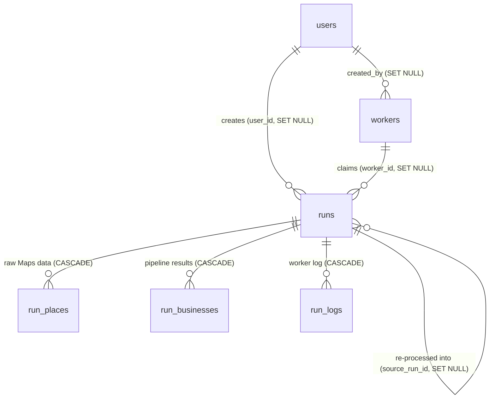

# Database

MySQL 8, InnoDB, `utf8mb4` / `utf8mb4_unicode_ci`. All timestamps are stored in UTC. The schema is defined only by migrations in `database/migrations/`; there's no SQL dump to import. Run `php artisan migrate --force`.

## Relationships



Deleting a run deletes its places, results and logs. Deleting a user or worker keeps their runs (the reference becomes NULL).

## Tables

### users

| Column | Type | Notes |
|---|---|---|
| id | bigint PK | |
| name | varchar(255) | |
| email | varchar(255) | **unique** |
| password | varchar(255) | bcrypt |
| role | varchar(20) | `admin` \| `member`, not mass-assignable |
| is_active | boolean | deactivated users can't sign in, not mass-assignable |
| last_login_at | timestamp null | |
| remember_token, email_verified_at, timestamps | | Laravel defaults |

### workers

| Column | Type | Notes |
|---|---|---|
| id | bigint PK | |
| name | varchar(100) | |
| token_hash | char(64) | **unique**, SHA-256 of the token. The token itself is never stored |
| token_prefix | varchar(12) | first characters, for display |
| created_by | FK users null | ON DELETE SET NULL |
| last_seen_at | timestamp null | **index**, "online" = seen within `WORKER_ONLINE_SECONDS` |
| last_ip, version, hostname | | reported by the worker |
| usage | json null | worker's daily-limit status (used, limit, canStart, nextStartAt, reason…) |
| revoked_at | timestamp null | revoked workers get 401 |

### runs

| Column | Type | Notes |
|---|---|---|
| id | bigint PK | |
| user_id | FK users null | SET NULL |
| worker_id | FK workers null | SET NULL, the worker that claimed it |
| source_run_id | FK runs null | SET NULL, for re-process runs |
| type | varchar(20) | `scrape` \| `reprocess` \| `import` |
| status | varchar(20) | `queued` → `claimed` → `running` → `completed` \| `failed` \| `cancelled` |
| queries | json | list of Google Maps searches |
| options | json null | `limit`, `months`, `noSocials`, `allowUnverified`, `phoneIsChannel` (whether phone counted as a channel for this run) |
| cancel_requested | boolean | picked up by the worker on its next log flush |
| progress | json null | live counters for the progress panel |
| meta | json null | `contactDistribution` (per-search A/B/C/D table), `enrichmentStats`, `blocked`, `limitHit`… |
| places_count, leads_count, hot_count, warm_count, unreachable_count, inactive_count, tier_a_count, tier_b_count, tier_c_count | unsigned int | denormalised, recomputed on completion, so run lists never run COUNT queries |
| error | text null | |
| claimed_at, finished_at, last_activity_at | timestamp null | `last_activity_at` drives stale-run detection |

Indexes: `(status, type, id)` for claiming the oldest queued job, `(user_id, created_at)`, `created_at`.

Claiming uses a conditional `UPDATE … WHERE id = ? AND status = 'queued'`, so two workers can never claim the same run, with no table locks.

### run_places

Raw place records from Google Maps, as the worker scraped them. Kept so a run can be re-processed without contacting Google.

| Column | Type | Notes |
|---|---|---|
| id | bigint PK | also the paging cursor for the worker |
| run_id | FK runs | CASCADE |
| query | varchar(255) | |
| place_key | varchar(191) | Google place id (`0x…:0x…`); longer keys are SHA-1 hashed |
| name | varchar(255) | |
| data | json | the full place object |
| created_at | timestamp | **index** |

Unique `(run_id, place_key)`: uploads are upserts, so retries never duplicate.

These rows are also the meter for the shared scraping budget: `ScrapeBudget` counts places created in the last 24 hours across all runs of type `scrape` whose worker shares the requesting worker's `last_ip`. Re-process runs copy places server-side but are excluded, because they never contact Google.

### run_businesses

One row per business per run, with the pipeline outcome.

| Column | Type | Notes |
|---|---|---|
| id | bigint PK | |
| run_id | FK runs | CASCADE |
| stage | varchar(20) | `lead` (tier A–C, scored) \| `unreachable` (tier D) \| `inactive` |
| query | varchar(255) | |
| place_key | varchar(191) | |
| name, category, phone, address | varchar | |
| website, maps_url | text | untrusted: only rendered as links if http(s) |
| website_status | varchar(150) | e.g. "No website", "Website down" |
| contact_tier | char(1) null | A/B/C/D |
| reason_code | varchar(40) null | `EMAIL_FOUND`, `PHONE_ONLY`, `INACTIVE`… |
| email | varchar(254) null | best email (leads only) |
| score | tinyint null | 0–100 (leads only) |
| priority | varchar(10) null | Hot/Warm/Cold |
| rating | decimal(2,1) null | |
| review_count | unsigned int | |
| newest_review | varchar(60) null | e.g. "3 weeks ago" |
| pitch | json null | suggested offers |
| detail | json | full record: place, activity, site audit (including marketing tags and store detection), socials, channels, contact, scoring with its `areas` (≤ 512 KB) |
| timestamps | | |

Indexes:

| Index | Used by |
|---|---|
| unique `(run_id, place_key)` | idempotent result uploads |
| `(run_id, stage, score)` | run page tabs sorted by score |
| `(stage, contact_tier, score)` | cross-run Leads page |
| `(query, stage)` | Search insights |
| `place_key` | "newest result per business" (`MAX(id) GROUP BY place_key`) |
| `email` | email search |

### run_logs

| Column | Type | Notes |
|---|---|---|
| id | bigint PK | the browser polls with `?after=<id>` |
| run_id | FK runs | CASCADE |
| level | varchar(10) | info / warn / error |
| message | text | control characters stripped, ≤ 2000 chars |
| created_at | timestamp | **index**, pruned after `RUN_LOG_RETENTION_DAYS` |

Index `(run_id, id)`.

### Laravel framework tables

`sessions`, `password_reset_tokens`, `cache`, `cache_locks`, `jobs`, `job_batches`, `failed_jobs`, `migrations`. These are standard, and they back the database-driven session, cache (rate limits, scheduler locks) and queue.

## Seeders

`php artisan db:seed --force` creates the first admin **only** when no users exist and `INITIAL_ADMIN_EMAIL` and `INITIAL_ADMIN_PASSWORD` are set. It exists for hosts without SSH. The recommended way is `php artisan app:create-admin`.

## Backups

Site Tools → **Security → Backups** covers the database. For a manual dump over SSH:

```bash
mysqldump --single-transaction -u DB_USERNAME -p DB_DATABASE > gscraper-$(date +%F).sql
```
